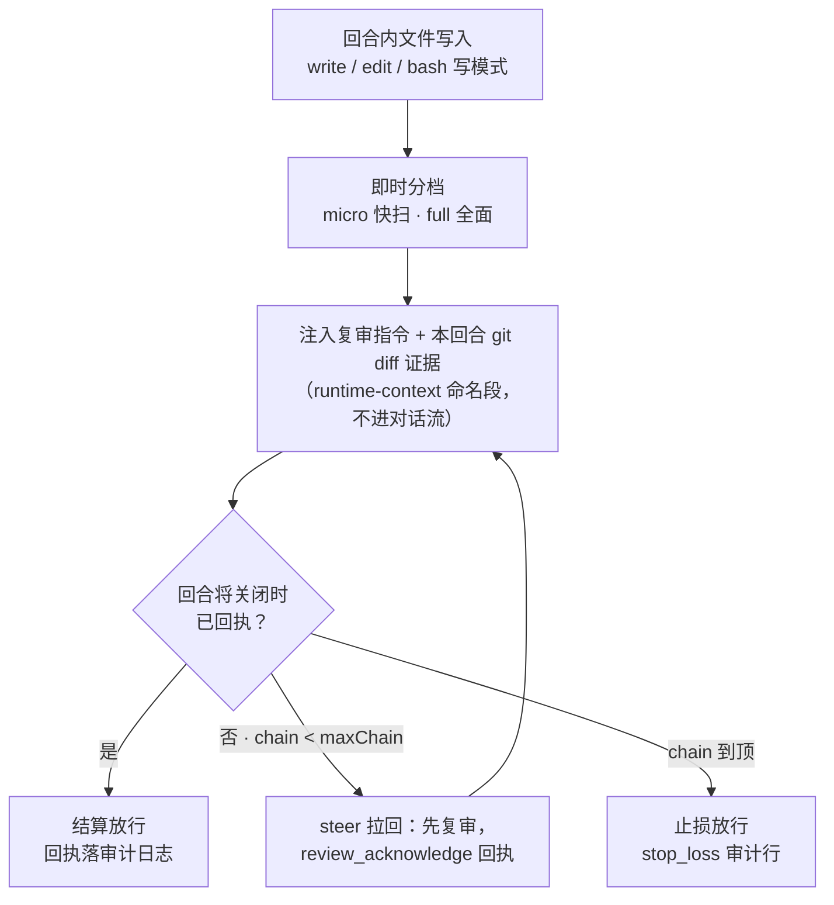

<div align="center">

# dsh-review-gate

**把「改完必须复审」从文档约定，变成宿主强制机制**

DSH（DeepSeek Harness）宿主插件 · 回合收尾自动拦截 · 结构化回执全程审计


</div>

## 为什么需要它

LLM 编码代理有个老问题：你在 AGENTS.md 里写「每次改动收尾必须全面复审」，模型答应得好好的，赶工时照样跳过——**文档约定靠自觉，自觉不可靠**。

dsh-review-gate 把这条约定下沉到宿主层：一个回合里只要发生了文件写入（write/edit，或 bash 命中写模式），回合即将关闭时自动把 agent **拦回来**执行一轮自我复审。复审完成以 `review_acknowledge` 结构化回执为唯一完成信号，逐行落审计日志——不依赖模型自觉，不需要用户盯梢。

- 小改动走 **快扫**（L1），大改动走 **五步全面复审**——分档自动判定，参照 Qoder Security 的渐进式扫描
- 全面复审方法论（coverage 诚实 / 证据链 / severity 校准 / 收敛判据）吸收自 **Codex Security 实码研究**
- 拦截是「拉回复审」，不是「拒绝收工」——止损上限保证永不卡死对话

## 工作原理



1. **写即武装**：监听 `tools/result`，write/edit 按 session 记录被写文件，每次写**即时重新分档**（`auto`：文件数、diff 行数、会话漂移、命中 `alwaysFullGlobs` → 全面；否则快扫）并置 pendingReview。bash 命令命中写模式（重定向 / `sed -i` / `mv` / `npm install`…）也会武装。
2. **带证据的事中引导**：pendingReview 期间向 runtime-context 注入 `review-gate` 命名段——复审指令 + **本回合 git diff**（懒取证一次，300 行截断，非 git 目录降级提示）+ bash 疑似写入命令清单。不进对话流，客户端折叠渲染。
3. **唯一完成信号**：模型完成复审后必须调用 `review_acknowledge` 工具提交结构化回执（action / files / findings / fixes_made / summary），落 `~/.dsh/storages/review-gate/receipts.jsonl` 审计日志。每次新写会使旧回执失效——**新改动欠新复审**。
4. **拦截与止损**：回合将关时未回执 → steer 一条极简驱动消息把 agent 拉回；连续未回执最多 `maxChain` 次后止损放行，止损行为落 `stop_loss` 审计行，可统计复审放弃率。
5. **防循环恢复**：用户新消息被认领时 chain 衰减 1——止损后每个用户回合保底恢复 1 轮复审；无写操作且无 bash 命中的回合把 chain 清零；`source.kind === 'review-gate'` 的自产驱动消息不参与衰减（防 steer 续步打穿止损）。

## 核心特性

| 特性 | 说明 |
|---|---|
| 分档复审税 | `auto` 按改动体量分档：快扫管小改，全面复审留给大改与会话漂移，不让复审税吃掉小任务 |
| diff 证据注入 | 复审指令自带本回合 git diff，消除「凭对话记忆复审」的漂移 |
| 结构化回执 | findings 数组（文件 / 行号 / severity / note）+ fixes_made + summary，逐行审计可回放 |
| 收敛疲劳防护 | 连续 K 次全面复审零新发现 → 会话漂移不再升格全面（借鉴 Codex stop-after-no-new，改造为会话级状态机） |
| 止损与恢复 | `maxChain` 止损 + 用户回合保底恢复 + source 门控，防死循环也防误伤 |
| 项目陷阱注入 | `pitfallsFile` 指向项目陷阱清单，激活时读一次，全面复审时逐条对照（显式标注为不可信分析数据，防提示注入） |
| 多 session 隔离 | 按 agent.id 键控状态，多会话互不串扰 |
| bash 启发式 | bash 直写不进事件层，命令模式启发式兜底（宁多触发不漏触发） |
| 降级可观测 | 运行时上下文装配异常时落 `assemble_degraded` 审计行，闸门失活可发现 |

## 安装与卸载

### 前置

- [DSH（DeepSeek Harness）](https://github.com/deepseek-ai/deepseek-harness) 已安装——本插件针对 `0.1.7-rc.2` 开发（peer 依赖 `@deepseek-ai/*` 同版本线）
- 一个在用的 profile（下文以 `web` 为例，换成你自己的 profile 名即可）

### 安装

```sh
git clone https://github.com/mexiaosqwq/dsh-review-gate.git ~/dsh-review-gate
cd ~/dsh-review-gate
npm install                                    # 装插件自身的 peer 依赖（cordis / dsh-agent / schemastery 等）
dsh plugin --profile web add ~/dsh-review-gate # 注册进目标 profile
```

然后**重启目标 profile**——宿主只在启动时加载插件 bundle，之后不再重读磁盘。

安装机制（一句话）：`dsh plugin add` 是 pnpm 透传，本地目录以 `link:` 符号链接进 profile，宿主按磁盘路径直接读源目录——所以**更新不需要重新 add**。

验证：

```sh
dsh --profile web --dump-config   # 应出现 id: review-gate 层
```

之后任意含文件写入的任务结束时：出现折叠的复审通知 → agent 被拉回复审 → 复审完成调用 `review_acknowledge`（工具卡片可见）→ `receipts.jsonl` 留下审计行。

### 配置

开箱即用（`auto` 分档），无需任何配置。改键有两条路，按生效时机选：

**运行时调整（即时生效，无需重启）**——力度的日常调节走这里：

- **网页面板**：会话输入框区的审查力度 chip（四态盾形图标），点击弹窗直接切档；M2 起弹窗内含调参表单（5 个阈值数字 + 豁免/强制全面 glob 清单 + 「高级」折叠区 writeTools）与实时仪表盘（本会话链/漂移/疲劳计数 + 今日复审/止损统计）——改一项 POST 一项，即时生效；会话/全局作用域切换跟随弹窗顶部的 scope toggle
- **对话**：让 agent 调 `review_gate_config` 工具——「把审查调到 full」「复审力度调轻一点」「恢复默认」，get/set/reset 即时生效
- **HTTP**（面板后端，也可 curl）：`GET /plugin/review-gate/config` 读（`?sessionId=` 附带返回该会话生效完整配置 `effective`、活会话计数 `states`、今日回执统计 `receipts`）；`POST` 同路径提交部分键即改（未知键忽略并在响应 `ignored` 列出；glob 键含 `?` 直接 400——`globToRegExp` 对 `?` 静默错译，三入口同守卫）；`POST /plugin/review-gate/config/reset` 恢复启动时配置

运行时可调键 = `mode / fullAtFiles / fullAtLines / exemptBelowLines / milestoneAtFiles / maxChain / noNewReviewsBeforeDemotion / alwaysFullGlobs / ignoreGlobs`（HTTP 面额外收 `writeTools`）。改动持久化到 `receiptDir` 下的 `config.json` 覆盖层，重启后依然生效。

**启动级（改文件 + 重启 profile）**——只用于路径键（`pitfallsFile` / `receiptDir`，运行时面刻意不收它们）或想把默认值写进组合文件：在 **profile 层 patch**（`~/.dsh/profiles/<profile>/cordis.patch.yml`）追加一段针对 `id: review-gate` 的覆盖行：

```yaml
- id: review-gate
  config:
    mode: full
    alwaysFullGlobs:
      - "src/contracts/**"
```

两个语法要点（Cordis patch 方言）：

- 带 `id` 且无 `insert` 的行 = 覆盖既有层；`config` 是**整段替换**，不做深合并（本插件 bundle 层的 config 为空 `{}`，所以追加即可，无需复述别的字段）
- 不想持久化就用启动时临时挂载：`dsh --profile web --patch <文件>`

启动序：schema 默认 → bundle patch → **存储覆盖层**（面板/工具改动最后落地、优先级最高）。全部键与默认值见下节配置表（schema 权威：`dsh --profile web --dump-config-schema`）。

### 更新

```sh
cd ~/dsh-review-gate && git pull && npm run build
# 重启目标 profile
```

`lib/` 构建产物已入库：纯文档/测试改动只需 `git pull`；动了 `src/` 才需要 build（测试跑的是 `lib/`，忘 build 会得到旧码全绿的假象）。

### 卸载

```sh
dsh plugin --profile web remove dsh-review-gate
```

重启 profile 后闸门即消失；`receipts.jsonl` 审计日志保留在 `receiptDir`，不随卸载删除。

## 配置

| 键 | 默认 | 说明 |
|---|---|---|
| `mode` | `auto` | `off` 关闭 / `micro` 固定快扫 / `full` 固定全面 / `auto` 按改动体量分档 |
| `fullAtFiles` | `3` | `auto` 模式下，改动文件数达到该值走全面复审 |
| `fullAtLines` | `150` | diff 增删行数达到该值，快扫升格全面（行数在取证时懒判定） |
| `exemptBelowLines` | `10` | `auto` 模式下，单文件回合的 diff 改动行数低于该值则**整回合免复审**（豁免落 `outcome:waived` 审计行；`0` 关闭；固定 micro/full 档不受影响；bash 写命中或多文件回合不豁免） |
| `milestoneAtFiles` | `10` | `auto` 模式下，会话累计改动文件数达到该值视为漂移，升格全面复审（受 `noNewReviewsBeforeDemotion` 疲劳守卫钳制） |
| `maxChain` | `2` | 连续未 ack 的拦截上限（止损） |
| `writeTools` | `["write","edit"]` | 视为代码写入的工具名 |
| `ignoreGlobs` | `[]` | glob 清单，命中路径的写入不计入复审触发（不支持 `?` 通配） |
| `alwaysFullGlobs` | `[]` | glob 清单，命中路径的写入无条件走全面复审 |
| `pitfallsFile` | （未设置） | 项目陷阱清单文件路径；插件激活时读一次，存在时全面复审指令追加「已知项目陷阱」节（含来源标注，按不可信分析数据对待） |
| `receiptDir` | `~/.dsh/storages/review-gate` | 回执审计日志目录 |
| `noNewReviewsBeforeDemotion` | `3` | 连续 K 次 full 复审零新发现后，会话漂移（milestone）不再升格全面复审（收敛疲劳防护；不影响基本分档与止损） |

## 已知边界（诚实清单）

闸门保证的是「**复审必发生**」（回执可审计）与「**复审必有证据**」（diff 注入），不保证「复审必找出所有 bug」——复审质量仍取决于模型执行指令的认真程度。

- bash 直写不走 FileSystem service（事件层不可见），命令模式启发式部分覆盖，有误报 / 漏报——只武装不阻断，方向保守（多触发一次复审无害）
- 写失败的工具调用（如 edit 报错）也计入改动——同为方向保守
- 空 diff（把文件改回原样）与非 git 环境在取证时同型（collectDiff 不区分两态），豁免按保守处理——触发快扫而非免审
- `turn-stopping` 语义是「模型暂时不欠响应」，回合中间的停顿也会触发拦截，可能与进行中的工作交叠
- 用户中断会清空 inbox，待执行的复审随之取消（用户干预优先）
- 自定义 source kind 的消息在会话重建时依赖 inbox 投影对 source 的容忍（待审窗口极短，最坏丢失一次复审提示）
- `agent.steer()` 为 `Agent` 接口契约成员——`typeof` 守卫保留作纵深防御，失效语义为不触发复审而非报错

## 面向插件开发者：部署笔记

本节记录与宿主其他插件的共存契约，改机制前必读。

- **Slot 所有权**：本插件与 dsh-fs-observation-policy 消费同类文件系统信号，但两者不同 slot、互不竞争。policy 挂在 base 层先激活，其 fs-intent 监听器不调 `next()` 即终裁整链（waterfall first-registrant 语义，realloop veto 测试双向实证）——v5-T3 之前 review-gate 的 fs-intent 监听器从未被调用过（死车道），现已整体清除。**结论：review-gate 不依赖 fs-intent 车道，无 slot 竞争敏感面。**
- **tools/result 兜底为何充分**：写跟踪信号面 = `tools/result`（按 `writeTools` 清单识别）+ bash 写模式启发式（partial，见上方边界）。fs-intent 本可覆盖「走 FileSystem service 但工具名不在 writeTools 的未来工具」，但该能力在宿主上从未生效（上述死车道），删除无行为回退——单信号时代 Set.add 幂等性天然防同文件重复计数。
- **重启契约（两半区不对称）**：宿主半区（`lib/index.js`——事件/工具/HTTP/配置语义）boot 时载入进程，改后必须重启目标 profile；`npm run build` 不触碰运行中宿主（实测教训：修复提交后 16 小时旧 bundle 仍在跑，造成拦截-重发循环复发与排查误导）。**client 半区（`lib/client.js`）不需要重启**：宿主按 rev 内容寻址下发、GUI client-plugin HMR receiver 接管，rebuild 后刷新/热更即达（2026-09-30 真机实证：chip 图标改动未重启自动生效）。

## 开发

> **AI 协作 / 贡献者必读**：[AGENTS.md](AGENTS.md) 是本仓库的项目知识库——架构红线、验证链、已知陷阱、文档路由都在里面。无论人还是 AI，动手改代码前先读它。

```
├─ src/
│  ├─ index.ts        接线层：apply() + Config schema + review_acknowledge 工具注册 + 全部事件监听
│  ├─ state.ts        状态机核心：decideReview 分档 / handleTurnStopping 拦截止损 / trackWrite / collectDiff
│  └─ instruction.ts  复审指令文案：MICRO/FULL 两档五分区、reviewInstructionText、驱动消息
├─ test/
│  ├─ gate.test.mjs      67 例单元（分档 / 写跟踪 / 注入形态 / 回执六路径 / 止损衰减 / 多 agent 隔离 / bash 启发式 / 疲劳防护 / receipts 终态）
│  └─ realloop.test.mjs  6 例真时序（dsh-agent-loop-testkit 驱动真实 AgentLoop：止损裁决 / ack 即结算与重放零拦截 / veto 语义 / 双源交叉断言）
├─ lib/               tsc 产物（package main 指向，fresh clone 即用）
├─ cordis.patch.yml   bundle patch：向 profile 插一层 id: review-gate
└─ docs/              设计计划（superpowers/plans/）与决定台账（handover/decisions.md）
```

```sh
npm install            # package-lock.json 权威
npm run build          # tsc → lib/；改 src 后必跑
npm test               # gate 单元 67 例（import lib/ —— 先 build 再 test，否则测旧码）
node --test test/realloop.test.mjs   # 真时序 6 例（较慢，单独跑）
```

验证顺序：改 src → build → gate + realloop 全绿 → 提交（含 lib/）→ 重启目标 profile → 真机验收（receipts.jsonl 留痕）。

## 设计档案

- **v2 计划（回执化 + 证据化）**：`docs/superpowers/plans/2026-09-27-review-gate-v2.md`——`review_acknowledge` 结构化回执、git diff 证据注入、多 session 隔离、回执审计日志的设计与实施
- **v4 计划（真时序测试基建）**：`docs/superpowers/plans/2026-09-28-review-gate-v4-realloop-tests.md`——第一方 `dsh-agent-loop-testkit` 驱动真实 AgentLoop 的测试车道，实证 steer 时序、ack 重放零拦截、waterfall 单槽 veto 语义
- **v5 批次（夜间自主推进 + 晨间 digest）**：`docs/superpowers/plans/2026-09-28-overnight-v5.md`；所有用户拍板 / 缓办决定见 `docs/handover/decisions.md` 台账

## 血统

- **AGENTS.md §10.5**：改动收尾全面复审的文档约定——本插件就是它的强制化
- **Qoder Security**：三层渐进扫描 → micro/full 两档分档复现
- **Codex Security**（实码深研）：coverage 诚实、证据三连接、四视角数据流、severity 校准五条配方并入全面复审指令；stop-after-no-new 收敛语义改造为会话级疲劳防护；边界枚举方法论进入复审指令

## License

[MIT](LICENSE) © mexiaosqwq
